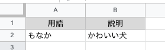
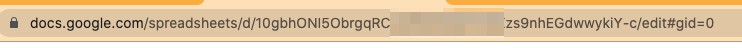
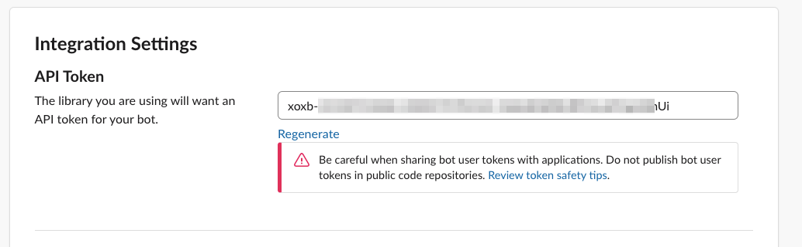
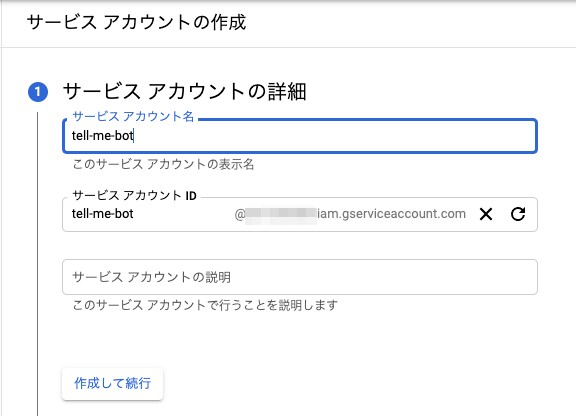
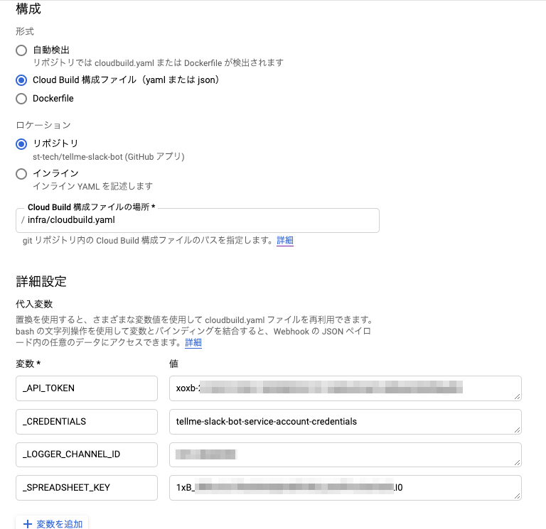
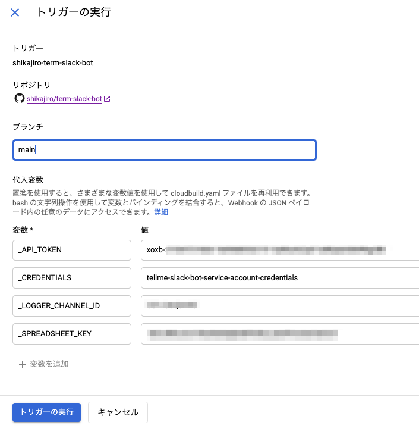

## これはなに
主に用語集を教えてくれるbotです。

## 準備

### SpreadSheetに用語をまとめる
まずはデータとなる情報をSpreadSheetにまとめます。SpreadSheetを選んだのは誰でも追加編集削除が簡単なためです。A列に用語、B列にその説明を記載していきます。会社内で権限をオープンにしてどんどん用語を集めるのがいいでしょう。



### SpreadSheetのKeyを取得する
SpreadSheetのURLに含まれるKeyをメモしておきます。画像はモザイクを掛けていますが、今回の例だと `10g~Y-c` の部分がKeyになります。



### SlackAPIの作成
SlackにBotを追加します。[ワークスペースで利用するボットの作成 \| Slack](https://slack.com/intl/ja-jp/help/articles/115005265703-%E3%83%AF%E3%83%BC%E3%82%AF%E3%82%B9%E3%83%9A%E3%83%BC%E3%82%B9%E3%81%A7%E5%88%A9%E7%94%A8%E3%81%99%E3%82%8B%E3%83%9C%E3%83%83%E3%83%88%E3%81%AE%E4%BD%9C%E6%88%90) などを参考に作ってください。

tokenが作成できたらメモしておきます

 

botにはこのアイコン使ってください。かわいいので。

 

### GCPプロジェクトの準備
GAEを実行するためのGCPプロジェクトを準備します。作り方などは公式ドキュメントがあるので割愛します。

### サービスアカウントの作成
SlackBotがSpreadSheetの情報を取得するのにサービスアカウントが必要なので作ります。権限はとりあえず `閲覧者` にしています。
この時のサービスアカウントのメールアドレスをメモしておき、クレデンシャルファイルをjsonでダウンロードしておきます。

 

### SpreadSheetの共有権限を付与する
先程のサービスアカウントでSpreadSheetを読み取りできるように設定します。共有設定でサービスアカウントのメールアドレスを入力し、閲覧者権限を付与します。

 

ここまでの設定で、SpreadSheetのデータをSlackBotが読み取れるようになりました。

### サービスアカウントの保存
SlackBotがSpreadSheetにアクセスするためにサービスアカウントのクレデンシャルが必要です。秘密鍵が含まれるためgitで保存したくありません。SecretManagerを使ってサービスアカウントのクレデンシャルを保持しておき、CloudBuildを実行する際に取り込むようにしたいと思います。
先程作成したサービスアカウントのクレデンシャルをダウンロードして、シークレットの値として保存します。ここで作ったシークレットの名前を後ほど利用します。

 

### CloudBuildの設定
CloudBuildのトリガーを作ります。

#### イベント
手動呼び出しにします。

#### 構成
クラウドビルド構成ファイルを選択し、以下のファイルを指定します。
`infra/cloudbuild.yaml`

#### 代入変数
大事な環境変数は代入変数で指定できるようにしています。ここに今までメモしてきた値を入力します。

|変数名|値|
|---|---|
|_API_TOKEN|SlackのAPIトークン|
|_SPREADSHEET_KEY|SpreadSheetのKey|
|_CREDENTIALS|SecretManagerに保存したクレデンシャルの名前|
|_LOGGER_CHANNEL_ID|オプション：用語検索のログを出力するslack channnel IDを指定する|

 

## デプロイ
先程作ったCloudBuildを使ってビルドとデプロイを行います。実行ボタンを押してビルド・デプロイを行います。

 

これで用語を説明してくれるbotの完成です。アプリケーションを作るより用語集をみんなで育てて行く方が大変なので、みんなでがんばりましょう。

## 使い方

### bot呼び出し方
```
@tellme
or
@tellme help
```
簡単な使い方を教えてくれます。

```
@tellme sku
```
用語を送信すると説明をしてくれます

#### 細かい条件
- 大文字小文字どちらでもかまいません
- 2文字以上のクエリ文字は部分一致です
- 1文字のクエリ文字は完全一致です（基本的に対象となる用語がない）

## 番外編
### GASは権限で詰まる
当初GASのwebアプリケーションで作ろうとしました。GCPプロジェクトを作る必要がなくシンプルなのです。しかし、SpreadSheetが会社アカウントの場合SlackからGASにアクセスする際に認証を通す必要があり、Slackの仕組み上解決することができませんでした。SpreadSheetを完全に公開してもいい場合はGASだけで実装できます。